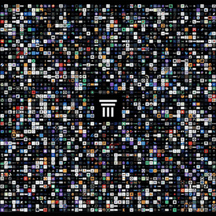

# logo-finder

[](https://www.python.org/)
[](https://opencv.org/)
[](./LICENSE)

**Find your logo in a sea of icons — then crop it, upscale it, or render a CSI-style zoom.**

Built for hackathon mosaics (Colosseum-style participant collages) where your icon is one of hundreds on a black grid. OpenCV multi-scale template matching locates it in seconds. No ML model, no GPU, no API keys.

---

## At a glance

| | |
|---|---|
| **Input** | A small logo PNG + a full mosaic image |
| **Output** | Coordinates, a cropped upscale, or an MP4/GIF zoom animation |
| **Speed** | Seconds on a laptop CPU |
| **Dependencies** | OpenCV, NumPy, Pillow |

<p align="center">
  
  <br>
  <em>find → enhance → animate — a CSI zoom from a sea of hundreds of icons to yours</em>
</p>

---

## Install

```bash
pip install -e .
```

Or install runtime deps only:

```bash
pip install -r requirements.txt
```

With [uv](https://docs.astral.sh/uv/):

```bash
uv sync
```

> **Headless environments** (CI, Docker, servers): swap `opencv-python` for `opencv-python-headless` in `pyproject.toml` / `requirements.txt`.

---

## Use it with Claude

This ships as a [Claude Code](https://claude.com/claude-code) skill. One command installs the CLI **and** the skill — then just ask Claude in plain language.

```bash
# from a clone:
./install.sh

# or straight from GitHub:
curl -fsSL https://raw.githubusercontent.com/ernanibmurtinho/colosseum-find-my-logo/main/install.sh | bash
```

Then, in Claude Code:

> *"Find my logo in this mosaic"* — and hand it your logo + the mosaic image.

The installer drops `logo-finder/SKILL.md` into `~/.claude/skills/` and puts the `logo-finder` CLI on your PATH. Set `CLAUDE_SKILLS_DIR` to install the skill elsewhere.

---

## Try it instantly

The repo bundles a runnable example — a Gecko logo and the real Colosseum mosaic:

```bash
# one-shot: find → enhance → animate
scripts/find-my-logo.sh logo_examples/gecko_logo.png logo_examples/logo_location_full_mosaic.png

# or just locate it
logo-finder find logo_examples/gecko_logo.png logo_examples/logo_location_full_mosaic.png
# → center=(2122, 2717)  confidence=0.99
```

---

## What's in this repo

| Path | Purpose |
|---|---|
| `src/logo_finder/matcher.py` | Multi-scale template matching; returns a `Match` with coordinates and confidence. |
| `src/logo_finder/enhance.py` | Crop the matched region and upscale to a target size. |
| `src/logo_finder/animator.py` | CSI-style zoom animation (MP4 + optional GIF). |
| `src/logo_finder/cli.py` | `logo-finder` CLI — three subcommands. |
| `examples/basic_usage.py` | End-to-end library example. |
| `examples/zoom.gif` | The demo animation shown above (a real Colosseum mosaic run). |
| `logo_examples/` | A bundled, ready-to-run example: a Gecko logo + the full Colosseum mosaic. |
| `skill/logo-finder/SKILL.md` | Claude Code skill so you can just ask Claude to find your logo. |
| `install.sh` | One-command installer: CLI + the Claude skill. |
| `scripts/find-my-logo.sh` | One-shot: find → enhance → animate in a single command. |

---

## What you get

| Command | What it does |
|---|---|
| `logo-finder find` | Print match coordinates and confidence. |
| `logo-finder enhance` | Crop the icon from the mosaic and upscale it. |
| `logo-finder animate` | Render a zoom-in from full mosaic → your logo. |

All commands take `<logo>` and `<mosaic>` as image paths. Run any subcommand with `-h` for full flags.

### CLI examples

```bash
# 1. Locate the logo and print coordinates
logo-finder find logo.png mosaic.png

# 2. Sanity-check: show top 3 candidates
logo-finder find logo.png mosaic.png -n 3

# 3. Crop and upscale to 1024×1024
logo-finder enhance logo.png mosaic.png -o enhanced.png --size 1024

# 4. Render a zoom animation (MP4 + GIF)
logo-finder animate logo.png mosaic.png -o zoom.mp4 --gif zoom.gif

# 5. Tune scale range if icons aren't ~60–90 px
logo-finder find logo.png mosaic.png --min-scale 40 --max-scale 130
```

---

## Library

```python
from logo_finder import find_logo, crop_and_upscale, animate_zoom

# Find it
match = find_logo("logo.png", "mosaic.png")
print(match)
# Match(x=2088, y=2683, size=68, confidence=0.99)
print(match.center)  # (2122, 2717)
print(match.bbox)    # (2088, 2683, 2156, 2751)

# Crop and upscale (pass match to skip re-searching)
crop_and_upscale("logo.png", "mosaic.png", "enhanced.png", target_size=1024, match=match)

# CSI zoom
animate_zoom(
    "logo.png", "mosaic.png",
    mp4_path="zoom.mp4",
    gif_path="zoom.gif",
    match=match,
    fps=30,
    duration_seconds=4.0,
)
```

See [`examples/basic_usage.py`](./examples/basic_usage.py) for a full script.

---

## How it works

```
1. Load logo + mosaic as color (BGR) images
   ↓
2. Resize logo to 50…110 px (configurable) and run cv2.matchTemplate at each scale
   ↓
3. Pick the scale + location with highest normalized cross-correlation
   ↓
4. (optional) Crop region → cubic upscale, or interpolate a zoom viewport
```

### Matching

Multi-scale **color** template matching (`TM_CCOEFF_NORMED`). Color disambiguates same-shaped icons that grayscale would conflate — e.g. a white mark with a blue underline vs. a plain white shape.

Default scale range `50..110` px is tuned for Colosseum-style mosaics where icons are ~60–90 px. Override with `--min-scale`, `--max-scale`, and `--scale-step`.

For `top_n > 1`, non-maximum suppression returns distinct candidates so you can verify the best match really stands out.

### CSI zoom

The animator interpolates a square viewport's `(center, size)` from "full image" to "tight crop around the logo":

- **Time easing** — ease-in-out cubic on progress
- **Size easing** — log interpolation so perceived zoom rate stays constant
- **Holds** — pause on the full mosaic at start, hold on the logo at end

---

## When it works / when it doesn't

| Scenario | Result |
|---|---|
| Axis-aligned icon in a grid mosaic | ✅ Strong matches (0.95+ typical) |
| Icon size within the scale range | ✅ Adjust `--min-scale` / `--max-scale` if not |
| Rotated or skewed icons | ❌ Needs feature matching (SIFT/ORB) — not included |
| Heavily compressed / color-shifted logos | ⚠️ Lower confidence; try a cleaner template |
| Multiple instances of the same logo | Use `-n 3` to inspect top candidates |

Upscaling cannot invent detail that isn't in the source pixels (~15× from a 68 px crop → 1024 px will be smooth but soft). For crisp output, use your original full-res logo; for AI-enhanced detail, pipe the crop through a super-resolution model (e.g. Real-ESRGAN).

---

## License

MIT. See [`LICENSE`](./LICENSE).

---

*Find your logo in the crowd. No GPU required.*
